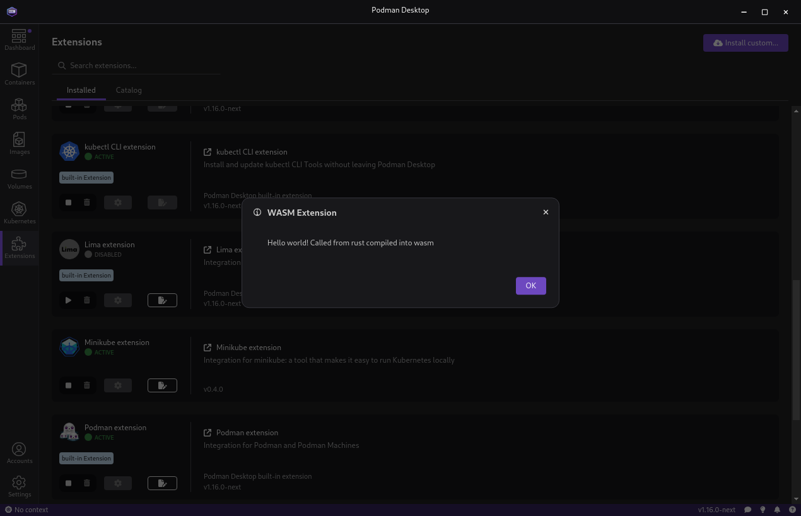

# Podman Desktop Extension written in Rust



## Overview

This is a POC for a Podman Extension written in Rust.

It uses [wasm-pack](https://github.com/rustwasm/wasm-pack) to generate the wasm that will be loaded.

## Testing it

You may test this demo by cloning it.

### Requirements

- You need to have a local [podman-desktop](https://github.com/podman-desktop/podman-desktop) repository cloned on your machine.

### Starting

Let's consider the following env
- `PODMAN_DESKTOP_PATH` the local path to podman-desktop repository
- `PD_RUST_EXTENSION`: the local path to this repository

```bash
$: cd $PODMAN_DESKTOP_PATH
$: pnpm watch --extension-folder $PD_RUST_EXTENSION
```

